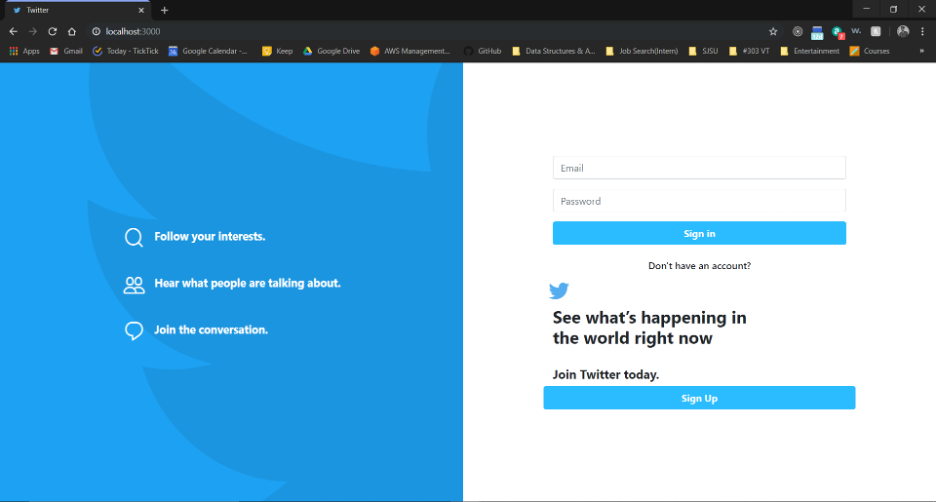
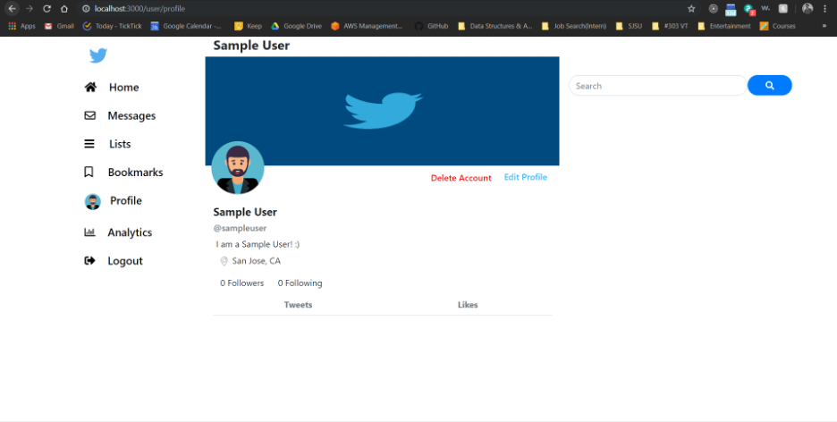
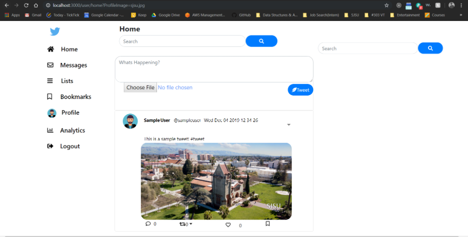
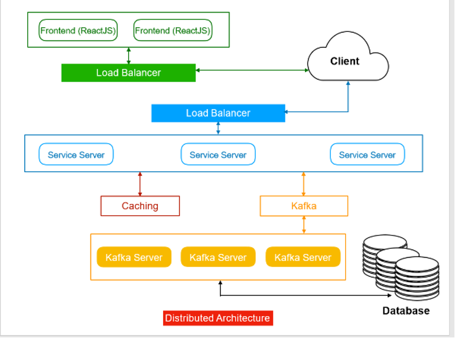
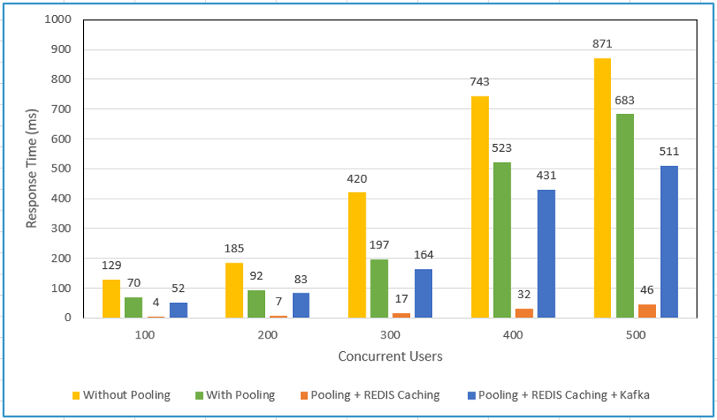
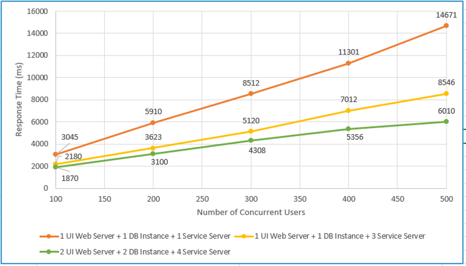

# Twitter WebApp Prototype

### Team Members
> 1. Sai Sandeep Jyothula
> 2. Naga Abhilash Reddy Julakanti
> 3. Nidhi Tattur Aravinda Kumar
> 4. Nithin Gollanapally
> 5. Rajesh Thummala

### Technology Stack - [MERN]
MongoDB
ExpressJS
ReactJS
Node.js
MySQL
Redis
Apache Kafka

### Steps to run the application
#### Frontend
```sh
$ cd frontend
$ npm install
$ npm start
```
#### Backend
```sh
$ cd backend
$ npm install
$ node index.js
```
#### Kafka
```sh
$ cd kafka-backend 
$ npm install
$ node server.js
```

### Application Screenshots
#### 1. Login Page


#### 2. Profile Page


#### 3. Home page



---

### Architecture



---

### performance graphs.png




